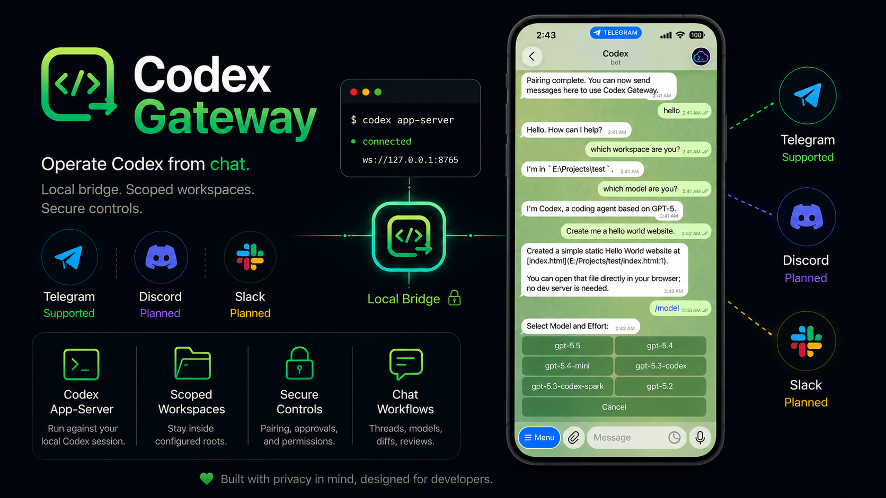

<p align="center">
  
</p>

<h1 align="center">Codex Gateway</h1>

<p align="center">
  Operate a local Codex app-server from Telegram while your credentials,
  workspace files, and gateway state stay on your machine.
</p>

<p align="center">
  <a href="#quick-start">Quick Start</a>
  &middot;
  <a href="#pair-telegram">Pair Telegram</a>
  &middot;
  <a href="#commands">Commands</a>
  &middot;
  <a href="#configuration">Configuration</a>
  &middot;
  <a href="#copy-paste-commands">Copy-Paste Commands</a>
  &middot;
  <a href="#roadmap">Roadmap</a>
  &middot;
  <a href="#development">Development</a>
</p>

## Overview

Codex Gateway is a local bridge between the Codex app-server and chat-style
channels. The current bridge is a Telegram bot for one authorized user, scoped
to configured local workspaces.

| Area | Current support |
| --- | --- |
| Gateway | Telegram |
| Backend | Local `codex app-server` |
| Transport | Loopback WebSocket by default, stdio fallback available |
| Default URL | `ws://127.0.0.1:8765` |
| Intended use | Personal local automation |
| Hosted operation | Out of scope |

## Features

- Single-user Telegram pairing with local CLI confirmation.
- Workspace allow-listing for all Telegram-started work.
- Codex thread start, resume, fork, archive, rollback, compact, review, diff,
  and status workflows.
- Inline Telegram controls for model, reasoning effort, permissions, modes,
  skills, approvals, and app-server-backed choices.
- App-server request handling for command approval, file approval, permissions,
  MCP elicitation, tool user input, and Telegram dynamic tools.
- Attachment download support with configurable size limits, image inputs,
  generated images, and workspace files sent back as native Telegram photos,
  videos, or documents.
- Telegram command-menu sync based on the locally generated app-server schema.
- Optional Windows background startup through the `CodexGateway` service.

<p align="center">
  <a href="https://ko-fi.com/xtianjamoner">
    
  </a>
  <br>
  <sub><a href="https://ko-fi.com/xtianjamoner">Support this project on Ko-fi</a></sub>
</p>

## Roadmap

Telegram is the current supported bridge. Future bridge candidates include:

- Discord: bot-based access for personal servers and private workflows.
- Slack: workspace app support for team channels and direct messages.

All bridges should keep the same local-first model: credentials, workspace
files, and gateway state stay on the user's machine.

## Requirements

- Python 3.11 or newer
- `uv`
- Codex CLI installed and authenticated with a ChatGPT/Codex account
- Telegram bot token from `@BotFather`
- Numeric Telegram user ID, for example from `@userinfobot`

```powershell
codex --version
```

Codex authentication comes from your local `codex` CLI/app-server session. This
gateway is for a Codex-capable ChatGPT account or subscription; it does not ask
for or use an OpenAI API key such as `OPENAI_API_KEY` to run Codex.

## Quick Start

GitHub shows a copy button on each fenced command block below.

On Windows, setup can sync dependencies, run tests, and configure Telegram
without elevation. Run from an elevated PowerShell only if you want it to
install or start the optional Windows Service.

```powershell
.\scripts\setup.ps1
```

For non-admin setup and manual foreground testing, skip service installation:

```powershell
.\scripts\setup.ps1 -SkipStartup
```

Dependency and test verification only:

```powershell
.\scripts\setup.ps1 -SkipTelegramSetup -SkipStartup
```

If `uv` is not installed, the script prints the official install command. To let
the script install `uv` first:

```powershell
.\scripts\setup.ps1 -InstallUv
```

Manual setup, if you want to run each step yourself:

```powershell
uv sync --extra dev
uv run pytest
uv run codex-gateway telegram setup
uv run codex-gateway telegram status
uv run codex-gateway telegram run
```

`telegram setup` writes a local `.env` file, creates the default workspace, and
sets the one Telegram user ID allowed to request pairing. Workspace roots can be
one directory or multiple directories separated by semicolon or comma. You can
rerun setup later; it detects existing `.env` values and pressing Enter keeps
the current token, user ID, workspace roots, default workspace, and default
permission profile. Existing values are shown in an `Existing Setup Detected`
section before the prompts.

Telegram keeps the active workspace per chat. `/setcwd` or `/workspace set`
changes it, `/new` and `/clear` keep using it, and `/start` does not reset it.
`/reset` or a stored workspace that is no longer inside the allowed roots moves
the chat back to the configured default workspace. Selecting a loaded thread can
also switch the chat to that thread's workspace when it is inside the allowed
roots.

Thread preferences are also stored per chat and workspace. Model and reasoning
effort are remembered separately for each collaboration mode, so a model chosen
while Plan mode is active is reused by `/plan` and does not replace the Default
mode model. `/new` and stale thread replacement reuse saved permissions,
approval policy, personality, memory mode, active mode, and that mode's model
and effort. `/clear` forgets only the active app-server thread ID; `/reset`
clears the saved preferences.

## Pair Telegram

1. Start the gateway with this command.

   ```powershell
   uv run codex-gateway telegram run
   ```

2. In Telegram, send `/start` to your bot from the configured user account.

3. Run the pairing command the bot replies with. Replace `<code>` with the
   code from Telegram.

   ```powershell
   uv run codex-gateway telegram access pair <code>
   ```

4. Wait for the pairing confirmation in Telegram, then send a normal message.

Other Telegram users are rejected and are not given pairing codes.

## Copy-Paste Commands

Use these blocks when you already know which operation you need.

| Task | Command |
| --- | --- |
| Install dependencies | `uv sync --extra dev` |
| Run tests | `uv run pytest` |
| Configure Telegram | `uv run codex-gateway telegram setup` |
| Show gateway status | `uv run codex-gateway telegram status` |
| Run the gateway | `uv run codex-gateway telegram run` |
| Pair a Telegram code | `uv run codex-gateway telegram access pair <code>` |
| List configured workspaces | `uv run codex-gateway telegram workspace list` |
| Show access state | `uv run codex-gateway telegram access status` |
| Update default permissions | `uv run codex-gateway telegram setup --permission-profile default` |
| Install or update Windows Service | `.\scripts\install-gateway-service.ps1 -Start` from elevated PowerShell |
| Restart Windows Service | `Restart-Service CodexGateway` from elevated PowerShell |
| Remove Windows Service | `.\scripts\setup.ps1 -RemoveStartup` from elevated PowerShell |

Full first-run sequence:

```powershell
uv sync --extra dev
uv run pytest
uv run codex-gateway telegram setup
uv run codex-gateway telegram status
uv run codex-gateway telegram run
```

Pair after `/start` replies in Telegram:

```powershell
uv run codex-gateway telegram access pair <code>
```

Run without setup prompts:

```powershell
.\scripts\setup.ps1 -SkipTelegramSetup -SkipStartup
```

Run setup without elevation by skipping the Windows Service:

```powershell
.\scripts\setup.ps1 -SkipStartup
```

Update the default permission profile from PowerShell:

```powershell
uv run codex-gateway telegram setup --permission-profile read-only
uv run codex-gateway telegram setup --permission-profile default
uv run codex-gateway telegram setup --permission-profile auto-review
uv run codex-gateway telegram setup --permission-profile full-access
```

## Commands

| Command | Purpose |
| --- | --- |
| `/status` | Show workspace, thread, account, context usage, token usage, and rate limits. |
| `/projects`, `/setcwd <path>`, `/getcwd` | Inspect or change the active workspace. |
| `/new`, `/resume`, `/threads` | Manage Codex threads. |
| `/reset`, `/clear` | Reset chat state or clear local thread mappings. `/clear` preserves the active workspace and preferences. |
| `/model`, `/permissions`, `/mode`, `/personality` | Change persisted thread settings with inline selectors where available; model and effort are mode-scoped. |
| `/diff`, `/review`, `/compact`, `/mention <path>` | Run common Codex workflows. |
| `/steer <text>`, `/cancel` | Control an active turn. |
| `/plugins`, `/skills`, `/mcp`, `/features`, `/config`, `/debug-config` | Inspect local Codex app-server capabilities. |
| `/commands` | Sync Telegram's slash-command menu. |

Some commands depend on app-server features exposed by the current Codex account
or build. For example, `/apps` is hidden unless the app catalog is visible.
Commands unsupported by the generated local schema are hidden or reported as
unavailable.

## Configuration

The interactive setup writes these values to `.env`. Real environment variables
override `.env` values.

| Variable | Purpose |
| --- | --- |
| `CODEX_GATEWAY_TELEGRAM_BOT_TOKEN` | Telegram bot token used by `telegram run`. |
| `CODEX_GATEWAY_TELEGRAM_ALLOWED_USER_ID` | Numeric Telegram user allowed to pair. |
| `CODEX_GATEWAY_TELEGRAM_STATE_DIR` | Local pairing, chat, thread, approval, and download state. |
| `CODEX_GATEWAY_ALLOWED_ROOTS` | Workspace roots the gateway may use; separate multiple roots with semicolon or comma. |
| `CODEX_GATEWAY_DEFAULT_CWD` | Default workspace, required to be inside an allowed root. |
| `CODEX_GATEWAY_CODEX_BIN` | Codex executable, default `codex`. |
| `CODEX_GATEWAY_APP_SERVER_URL` | Loopback WebSocket URL, default `ws://127.0.0.1:8765`. |
| `CODEX_GATEWAY_APP_SERVER_TRANSPORT` | `websocket` or `stdio`, default `websocket`. |
| `CODEX_GATEWAY_TELEGRAM_MODEL` | Optional model override for new threads. |
| `CODEX_GATEWAY_TELEGRAM_PERMISSION_PROFILE` | Default permissions for new Telegram threads: `:read-only`, `:workspace`, `:auto-review`, or `:danger-full-access`. |
| `CODEX_GATEWAY_TELEGRAM_SANDBOX` | Sandbox setting for app-server threads. |
| `CODEX_GATEWAY_TELEGRAM_APPROVAL_POLICY` | Approval policy for app-server requests. |
| `CODEX_GATEWAY_ENABLE_EXEC` | Enables `/exec` when set to `1`. |
| `CODEX_GATEWAY_ADVERTISE_EXEC` | Shows `/exec` in Telegram when set to `1`. |

See `.env.example` for the full set of supported environment variables and
defaults.

Legacy `CODEX_TELEGRAM_*` variables are accepted as migration fallbacks, but
`CODEX_GATEWAY_*` names are canonical.

## Security Notes

- Keep `.env`, Telegram bot tokens, and `.codex-gateway/` state local.
- Telegram bots are reachable by anyone who knows the bot username or adds the
  bot to a chat. Treat Telegram delivery as untrusted input.
- Keep `CODEX_GATEWAY_TELEGRAM_ALLOWED_USER_ID` set to your own numeric
  Telegram user ID; users are denied by default, and only that configured user
  can pair and use the gateway.
- Avoid adding the bot to groups unless you explicitly want group-chat access
  control behavior.
- Use narrow workspace roots for `CODEX_GATEWAY_ALLOWED_ROOTS`.
- Leave `/exec` disabled unless you explicitly want Telegram messages to start
  local command-running Codex turns.
- Do not expose this gateway as a public or multi-user hosted service.

## Windows Service

The setup script can install and start the `CodexGateway` Windows Service. The
service starts the Telegram gateway without a foreground console window and
writes logs under `.codex-gateway\logs\service`.

Install, update, restart, or remove the service from an elevated PowerShell.
Restart the service after rerunning `telegram setup` or changing `.env` while
the service is already running.

Install or update the service:

```powershell
.\scripts\install-gateway-service.ps1 -Start
```

Restart the service:

```powershell
Restart-Service CodexGateway
```

Remove the service:

```powershell
.\scripts\setup.ps1 -RemoveStartup
```

## Development

Install dependencies and run tests:

```powershell
uv sync --extra dev
uv run pytest
```

Optional smoke probe against a real local app-server:

```powershell
uv run --script testing\probes\mock_bot_real_app_server_smoke.py --include-turns --exhaustive
```

The smoke probe requires an authenticated Codex CLI and may start a real local
app-server process.

## Repository Layout

| Path | Purpose |
| --- | --- |
| `src/codex_gateway` | Package source. |
| `src/codex_gateway/backends/codex_app_server` | App-server client, transport, lifecycle, and generated protocol metadata. |
| `src/codex_gateway/gateways/telegram` | Telegram bridge, Bot API client, commands, setup, access control, and local state. |
| `tests` | Unit and async behavior tests. |
| `testing/probes` | Optional smoke probes. |
| `scripts` | Windows setup and service helpers. |
